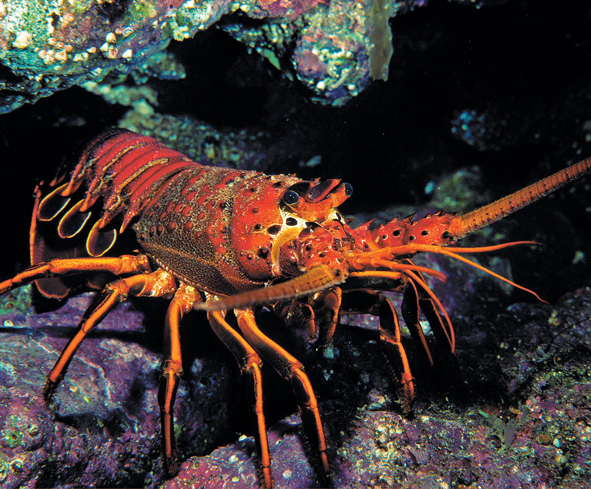
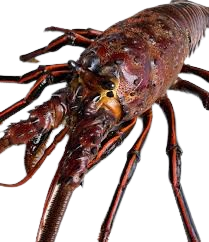

```{r setup, include=FALSE}
knitr::opts_chunk$set(eval=TRUE, warning = FALSE, message = FALSE )
```

------------------------------------------------------------------------



------------------------------------------------------------------------

### Assignment instructions:

-   Working with partners to troubleshoot code and concepts is encouraged! If you work with a partner, please list their name next to yours at the top of your assignment so Annie and I can easily see who collaborated.

-   All written responses must be written independently (**in your own words**).

-   Please follow the question prompts carefully and include only the information each question asks in your submitted responses.

-   Submit both your knitted document and the associated `RMarkdown` or `Quarto` file.

-   Your knitted presentation should meet the quality you'd submit to research colleagues or feel confident sharing publicly. Refer to the rubric for details about presentation standards.

**Assignment submission:** Tom Gibbens-Matsuyama

Collaboration with: Haylee, Ian

------------------------------------------------------------------------

### Load libraries

```{r}
#| code-fold: true
#| code-summary: Show the code

library(tidyverse)
library(here)
library(janitor)
library(estimatr)  
library(performance)
library(jtools)
library(gt)
library(gtsummary)
library(MASS) ## NOTE: The `select()` function is masked. Use: `dplyr::select()` ##
library(interactions) 
library(ggridges)
library(see)
library(DHARMa)

```

------------------------------------------------------------------------

#### DATA SOURCE:

Reed D. 2019. SBC LTER: Reef: Abundance, size and fishing effort for California Spiny Lobster (Panulirus interruptus), ongoing since 2012. Environmental Data Initiative. <https://doi.org/10.6073/pasta/a593a675d644fdefb736750b291579a0>. Dataset accessed 11/17/2019.

------------------------------------------------------------------------

### **Introduction**

You're about to dive into some deep data collected from five reef sites in Santa Barbara County, all about the abundance of California spiny lobsters! 🦞 Data was gathered by divers annually from 2012 to 2018 across Naples, Mohawk, Isla Vista, Carpinteria, and Arroyo Quemado reefs.

Why lobsters? Well, this sample provides an opportunity to evaluate the impact of Marine Protected Areas (MPAs) established on January 1, 2012 (Reed, 2019). Of these five reefs, Naples, and Isla Vista are MPAs, while the other three are not protected (non-MPAs). Comparing lobster health between these protected and non-protected areas gives us the chance to study how commercial and recreational fishing might impact these ecosystems.

We will consider the MPA sites the `treatment` group and use regression methods to explore whether protecting these reefs really makes a difference compared to non-MPA sites (our control group). In this assignment, we'll think deeply about which causal inference assumptions hold up under the research design and identify where they fall short.

Let's break it down step by step and see what the data reveals! 📊


------------------------------------------------------------------------

Step 1: Anticipating potential sources of selection bias

**a.** Do the control sites (Arroyo Quemado, Carpenteria, and Mohawk) provide a strong counterfactual for our treatment sites (Naples, Isla Vista)? Write a paragraph making a case for why this comparison is centris paribus or whether selection bias is likely (be specific!).

There is likely some amount of selection bias occuring. It is tough to compare whether or not MPAs are affecting species density because the control and treatment sites are not the same in everything else. For an experiment to be truly unbias, we would need everything else equal besides the treatment you are measuring. In this case it would be a site designated as a MPA or a non-MPA. However, there are other variables, such as, suitable habitat, food abundancy, predation pressure, competition, etc. that are not equal between control and treatment.

------------------------------------------------------------------------

Step 2: Read & wrangle data

**a.** Read in the raw data. Name the data.frame (`df`) `rawdata`

**b.** Use the function `clean_names()` from the `janitor` package

```{r}

# HINT: check for coding of missing values (`na = "-99999"`)

rawdata <- read_csv(here("data", "spiny_abundance_sb_18.csv"), na = "-99999") %>% 
    clean_names()

```

**c.** Create a new `df` named `tidyata`. Using the variable `site` (reef location) create a new variable `reef` as a `factor` and add the following labels in the order listed (i.e., re-order the `levels`):

```         
"Arroyo Quemado", "Carpenteria", "Mohawk", "Isla Vista",  "Naples"
```

```{r}
#| code-fold: true
#| code-summary: Show the code

# Create new column 'reef' and arrange as a factor in order above
tidydata <- rawdata %>% 
    mutate(reef = site) %>% 
    mutate(reef = recode(reef, 
                         "AQUE" = "Arroyo Quemado",
                         "CARP" = "Carpenteria",
                         "MOHK" = "Mohawk",
                         "IVEE" = "Isla Vista",
                         "NAPL" = "Naples")) %>% 
    arrange(factor(reef, 
                   levels = c("Arroyo Quemado", 
                             "Carpenteria", 
                             "Mohawk",
                             "Isla Vista",
                             "Naples")))
    
```

Create new `df` named `spiny_counts`

**d.** Create a new variable `counts` to allow for an analysis of lobster counts where the unit-level of observation is the total number of observed lobsters per `site`, `year` and `transect`.

-   Create a variable `mean_size` from the variable `size_mm`
-   NOTE: The variable `counts` should have values which are integers (whole numbers).
-   Make sure to account for missing cases (`na`)!

```{r}
#| code-fold: true
#| code-summary: Show the code

# Group_by & summarize total lobster counts
spiny_counts <- tidydata %>% 
    group_by(site, year, transect) %>% 
    summarize(counts = sum(count, na.rm = TRUE),
              mean_size = mean(size_mm, na.rm = TRUE)) %>% 
    ungroup() # always to ungroup at the end 
```

**e.** Create a new variable `mpa` with levels `MPA` and `non_MPA`. For our regression analysis create a numerical variable `treat` where MPA sites are coded `1` and non_MPA sites are coded `0`

```{r}
#| code-fold: true
#| code-summary: Show the code

# Create mpa & treat columns using case_when 
spiny_counts <- spiny_counts %>% 
    mutate(mpa = case_when(site %in% c("IVEE", "NAPL") ~ "MPA",
                           site %in% c("MOHK", "CARP", "AQUE") ~ "non-MPA"),
           treat = case_when(mpa == "MPA" ~ 1,
                             mpa == "non-MPA" ~ 0))


```

> NOTE: This step is crucial to the analysis. Check with a friend or come to TA/instructor office hours to make sure the counts are coded correctly!

------------------------------------------------------------------------

Step 3: Explore & visualize data

**a.** Take a look at the data! Get familiar with the data in each `df` format (`tidydata`, `spiny_counts`)

**b.** We will focus on the variables `count`, `year`, `site`, and `treat`(`mpa`) to model lobster abundance. Create the following 4 plots using a different method each time from the 6 options provided. Add a layer (`geom`) to each of the plots including informative descriptive statistics (you choose; e.g., mean, median, SD, quartiles, range). Make sure each plot dimension is clearly labeled (e.g., axes, groups).

-   [Density plot](https://r-charts.com/distribution/density-plot-group-ggplot2)
-   [Ridge plot](https://r-charts.com/distribution/ggridges/)
-   [Jitter plot](https://ggplot2.tidyverse.org/reference/geom_jitter.html)
-   [Violin plot](https://r-charts.com/distribution/violin-plot-group-ggplot2)
-   [Histogram](https://r-charts.com/distribution/histogram-density-ggplot2/)
-   [Beeswarm](https://r-charts.com/distribution/beeswarm/)

Create plots displaying the distribution of lobster **counts**:

1)  grouped by reef site

    ```{r}
    #| code-fold: true
    #| code-summary: Show the code

    # Histogram of lobster counts 
    ggplot(spiny_counts, aes(x = counts)) +
        geom_histogram(fill = "lightblue") +
        geom_vline(aes(xintercept = median(counts))) +
        facet_wrap(~site) +
        labs(y = "Frequency", x = "Lobsters Observed",
             title = "Distribution of lobsters observed at each site") +
        theme(axis.text.x = element_blank(),
              axis.line.x = element_blank())
    ```

    \

2)  grouped by MPA status

```{r}
#| code-fold: true
#| code-summary: Show the code

# Density plot of counts between MPAs and non-MPAs
ggplot(spiny_counts, aes(x = counts, 
                         color = mpa)) +
    geom_density() +
    geom_vline(aes(xintercept = mean(counts))) +
    facet_wrap(~ mpa) +
    labs(x = "Counts", y = "Density",
         title = "Distribution of lobster observations between MPAs and Non-MPAs") +
    theme_minimal()
```

1)  grouped by year

```{r}
#| code-fold: true
#| code-summary: Show the code

# Violin with boxplot underlaying 
ggplot(spiny_counts, aes(x = as.factor(year), y = counts)) +
    geom_violin() +
    geom_boxplot(width = 0.2, fill = "white",
                 color = "red", alpha = 0.2,
                 position = position_nudge(y = 0)) +
    labs(x = "Year", y = "Frequency",
         title = "Distribution of lobster observations from each year")
    
```

Create a plot of lobster **size** :

4)  You choose the grouping variable(s)!

```{r}
#| code-fold: true
#| code-summary: Show the code

# Ridge plot by transect
ggplot(spiny_counts, aes(x = mean_size, y = site, fill = site)) +
    stat_density_ridges(quantile_lines = TRUE) +
    labs(x = "Mean size (mm)", y = "Site",
         title = "Distribution of lobster mean size for each site")

```

**c.** Compare means of the outcome by treatment group. Using the `tbl_summary()` function from the package [`gt_summary`](https://www.danieldsjoberg.com/gtsummary/articles/tbl_summary.html)

```{r}
# Table comparing mean counts and size of MPAs vs non-MPAs
spiny_counts %>% 
    dplyr::select(treat, counts, mean_size) %>% 
    tbl_summary(by = treat,
                statistic = list(
      all_continuous() ~ "{mean} ({sd})"))
```

------------------------------------------------------------------------

Step 4: OLS regression- building intuition

**a.** Start with a simple OLS estimator of lobster counts regressed on treatment. Use the function `summ()` from the [`jtools`](https://jtools.jacob-long.com/) package to print the OLS output

**b.** Interpret the intercept & predictor coefficients *in your own words*. Use full sentences and write your interpretation of the regression results to be as clear as possible to a non-academic audience.

```{r}
#| code-fold: true
#| code-summary: Show the code

# OLS model 
m1_ols <- lm(counts ~ treat, data = spiny_counts)

summ(m1_ols, model.fit = FALSE) 

ggplot(spiny_counts, aes(x = treat, y = counts)) +
    geom_point() +
    geom_smooth(method = lm)

```

The intercept coefficient represents the y-intercept when treat = 0. When the x variable, treat (no MPA) = 0, we expect to see our y-variable (count) equal to 22.73. The treat coefficient represents the slope of our linear regression line, meaning when MPAs are present, we have an increase of 5.36 lobster counts per unit increase of treat. Since treat is a binomial variable, it can only be a 0 or a 1. This indicates that our linear regression model might not be the best fit for our data.

**c.** Check the model assumptions using the `check_model` function from the `performance` package

```{r}
# Check model assumptions 
check_model(m1_ols)
```

**d.** Explain the results of the 4 diagnostic plots. Why are we getting this result?

```{r}
# Check normality of residuals
check_model(m1_ols,  check = "qq" )
```

The "qq" plot above assesses the normality of the residuals. If the residuals were normally distributed, then they would all hover around the green line. We do not see this, suggesting the residuals are not normally distributed. This might indicate our independent and dependent variables don't have a true linear relationship.

```{r}
# Another way to check residual normality
check_model(m1_ols, check = "normality")
```

From the normality plot above, we see that the distribution doesn't follow the normal curve. This is similar to the "qq" plot as it suggests there may be a non-linear relationship between independent and dependent variables.

```{r}
# Check model homogeneity 
check_model(m1_ols, check = "homogeneity")
```

The homogeneity plot above does not follow does not follow a flat and horizontal shape. This indicates that our model has heteroscedasticity meaning our error increases or decreases as "treat" changes.

```{r}
# Compare simulated data to observed data 
check_model(m1_ols, check = "pp_check")
```

The observed data does not follow the model-predicted data, meaning the model might not be a good fit for the relationship of our predictors.

------------------------------------------------------------------------

Step 5: Fitting GLMs

**a.** Estimate a Poisson regression model using the `glm()` function

**b.** Interpret the predictor coefficient in your own words. Use full sentences and write your interpretation of the results to be as clear as possible to a non-academic audience.

From a Poisson model, we see different coefficients for our intercept and treat. We have an intercept of 3.12, meaning a value of log 3.12 lobster counts when treat is equal to 0 or non-MPAs are present. To find the expected lobster count we need to take the exponential of 3.12 = 22.6 lobsters. Likewise, we have a coeffcient of 0.21 for treat, by taking the exponential of 0.21 = 1.23 times the expected count for the reference group. Meaning we can find the percentage increase by (1.233 - 1) x 100 = 23.3% increase when MPAs are present.

**c.** Explain the statistical concept of dispersion and overdispersion in the context of this model.

Overdispersion in the context of a Poisson model suggests that the variance is greater than the mean. The variance should be the same as the mean for Poisson distributions.

**d.** Compare results with previous model, explain change in the significance of the treatment effect

We get very different intercept and treatment coefficients from this model because they represent the log of the change for each predictor. We expect to see different values. That being said, we have a different treatment p-value that went from 0.30 to 0.00, suggesting the treatment of MPAs is significant. OLS models are not meant to be used for "count" data, the Poisson is a better model for this, which is why we may see a significant p-value for our treatment.

```{r}
#| code-fold: true
#| code-summary: Show the code

m2_pois <- glm(counts ~ treat,
               family = poisson(link = "log"),
               data = spiny_counts)

summ(m2_pois, model.fit = FALSE)

```

**e.** Check the model assumptions. Explain results.

The poisson assumptions are as follows: 1) probability of one event is not affected by another: 2) average rate of which events occur is constant over time. 3) two events can't occur at the same time. 4) Mean and variance of distribution is equal.

**f.** Conduct tests for over-dispersion & zero-inflation. Explain results.

```{r}
check_model(m2_pois)
```

When looking at the plots from the "check_model" function, we still see differences in the observed data vs. the model-predicted data for every plot. This indicates that our model does not fit the data given. We should probably use a different model.

```{r}
check_overdispersion(m2_pois)
```

We have a really high dispersion ratio of 67.033, suggesting that overdispersion in the model. Overdispersion indicates that the variance is exceeding the mean which we would not expect for a good model.

```{r}
check_zeroinflation(m2_pois)
```

This function checks for observed zeros in our data and predicted zeros we should expect to see from the model. We have 27 observed zeros while we expect to see 0. The ratio of 0 suggests that we don't have a good model.

**g.** Fit a negative binomial model using the function glm.nb() from the package `MASS` and check model diagnostics

**h.** In 1-2 sentences explain rationale for fitting this GLM model.

The negative binomial glm model is often used when you have overdispersion in your Poisson model, which is what we see above.

**i.** Interpret the treatment estimate result in your own words. Compare with results from the previous model.

The coefficients for this model are the same as the previous one. The treat coefficient can be interpreted the same as the previous model, indicating that lobster counts increases with a value of log 0.21 when MPAs are present. Our standard error values are about 6 times greater than the previous model. Also, the z values are much smaller. In this model, we have a higher p-value of 0.22 for our treat variable. This is different from the last model as it is now insignificant.

```{r}
#| code-fold: true
#| code-summary: Show the code

m3_nb <- glm.nb(counts ~ treat, data = spiny_counts)

summ(m3_nb, model.fit = FALSE)

```

```{r}
check_overdispersion(m3_nb)
```

There is a much smaller dispersion ratio of 1.398 for this model. We still see overdispersion as the ratio is greater than 1, however it is much smaller than the Poisson model.

```{r}
check_zeroinflation(m3_nb)
```

This model is much better at predicting zero inflation. We expect to see 30 zeros and we actually observe 27 with a ratio of 1.12.

```{r}
check_predictions(m3_nb)
```

The observed and model-predicted data follow the same distribution. This is great as it indicates a better model than our previous ones.

```{r}
check_model(m3_nb)
```

Likewise, the other data within these plots follow what we would expect to see for a good model. So far, this model fits our data the best.

------------------------------------------------------------------------

Step 6: Compare models

**a.** Use the `export_summ()` function from the `jtools` package to look at the three regression models you fit side-by-side.

**c.** Write a short paragraph comparing the results. Is the treatment effect `robust` or stable across the model specifications.

```{r}
#| code-fold: true
#| code-summary: Show the code

# Summing all three models
export_summs(m1_ols, m2_pois, m3_nb,
             model.names = c("OLS","Poisson", "NB"),
             statistics = "none")


# Calculate percent change in waste piles in each model:

# ratio of treatment beta coeff / intercept
m1_est_ols = (5.36/22.73)*100  
m2_est_poi = (exp(0.21) -1)*100  
m3_est_log = (exp(0.21)- 1)*100     

# Kable table 
kableExtra::kable(tibble(m1_est_ols, m2_est_poi, m3_est_log))

```

Our models all have very similar percent change. This suggests the data is robust as we get the same results when running different models. If we had different percent change from each model, it would be difficult to understand which one represents the data the best. Now let's compare the coefficients of our models. The OLS model had significantly higher coefficients of 22.73 and 5.36 for our intercept and treat respectively. On the other hand, the next two Logistic models have coefficients of 3.12 and 0.21 for their intercept and treat variables respectively. In order, we went from insignificant, significant, and insignificant p-value for our treat variable.

------------------------------------------------------------------------

Step 7: Building intuition - fixed effects

**a.** Create new `df` with the `year` variable converted to a factor

**b.** Run the following OLS model using `lm()`

-   Use the following specification for the outcome `log(counts+1)`
-   Estimate fixed effects for `year`
-   Include an interaction term between variables `treat` and `year`

**c.** Take a look at the regression output. Each coefficient provides a comparison or the difference in means for a specific sub-group in the data. Informally, describe the what the model has estimated at a conceptual level (NOTE: you do not have to interpret coefficients individually)

This OLS model is changing the predictors in a variety of ways. First off, instead of predicting counts we are predicting the log(counts + 1). Second we are adding another variable, year, that interacts with our treat variable. The year coefficients increases over time. This suggests that year has a positive impact on the log(counts +1) of lobsters. Likewise, the interaction between treat and year has positive coefficients with some variation, again suggesting the treatment had a positive result on lobster counts over the years. From this model, we are interested in looking at how the year variable and the treat::year interaction variable is affecting our target variable. As the years progress, the treat::year coeffciients are increasing at a higher rate than our year variable, suggesting that MPAs have significant impact on lobster counts.

**d.** Explain why the main effect for treatment is negative? \*Does this result make sense?

The coefficient for treatment is -1.23. Let's go through this. When treat = 0, indicating no MPAs, then we have a higher initial count (in log(counts + 1) )value. When treat equals 1, we apply this negative to our intercept implying that we have a lower count value. This is for our reference year of 2012, where we just started comparing MPAs vs non-MPAs, so having a lower count initially is okay as the effects having started yet.

```{r}
#| code-fold: true
#| code-summary: Show the code

# Change year column to a factor 
ff_counts <- spiny_counts %>% 
    mutate(year=as_factor(year))

# New model w/ interaction
m5_fixedeffs <- lm(
    log(counts+1) ~ treat*year,
    data = ff_counts)

# Summarize model results 
summ(m5_fixedeffs, model.fit = FALSE)
```

**e.** Look at the model predictions: Use the `interact_plot()` function from package `interactions` to plot mean predictions by year and treatment status.

**f.** Re-evaluate your responses (c) and (b) above.

Yes, the plot supports my description of the results above. Initially, the treatment group has a lower log(count + 1) which is why our coefficient is negative. However, for both year and treat \* year, we see an overall positive trend in both the coefficients and the plot.

```{r}
#| code-fold: true
#| code-summary: Show the code

# Hint 1: Group counts by `year` and `mpa` and calculate the `mean_count`
# Hint 2: Convert variable `year` to a factor

interact_plot(m5_fixedeffs, pred = year, modx = treat,
              outcome.scale = "response")

```

**g.** Using `ggplot()` create a plot in same style as the previous `interaction plot`, but displaying the original scale of the outcome variable (lobster counts). This type of plot is commonly used to show how the treatment effect changes across discrete time points (i.e., panel data). The treat \* year coefficient have higher values than the year coefficients which is represented by the more positive slope in the plots.

The plot should have... - `year` on the x-axis - `counts` on the y-axis - `mpa` as the grouping variable

```{r}
#| code-fold: true
#| code-summary: Show the code

# Hint 1: Group counts by `year` and `mpa` and calculate the `mean_count`
# Hint 2: Convert variable `year` to a factor

# Create new df grouping by year and mpa 
ff_counts <- ff_counts %>% 
    group_by(year, mpa) %>% 
    summarize(mean_count = mean(counts))

# Plot year and mean count by mpa
plot_counts <- ggplot(ff_counts, aes(x = year, 
                                     y = mean_count, 
                                     color = mpa, 
                                     group = mpa)) +
    geom_line() +
    geom_point() +
    labs(x = "Year", y = "Mean Count") +
    theme_minimal()

# View plot 
plot_counts 


```

------------------------------------------------------------------------

Step 8: Reconsider causal identification assumptions

a.  Discuss whether you think `spillover effects` are likely in this research context (see Glossary of terms; <https://docs.google.com/document/d/1RIudsVcYhWGpqC-Uftk9UTz3PIq6stVyEpT44EPNgpE/edit?usp=sharing>)

    Spillover effects are possibly, but it is difficult to measure in this context. These sites are close enough to each other that I could see spill over of fish species, however I am not sure for lobsters. A quick google search suggests that spiny lobsters can migrate 20-30 miles, so spill over is plausible between sites. It should also be noted that the two MPAs are closer to each other than the other three control sites.

b.  Explain why spillover is an issue for the identification of causal effects

    Spill over is an issue for causal inference because it is referring to one's treatment having a direct affect on a control's outcome. This makes it difficult to measure the cause and effect of having a treatment vs control.

c.  How does spillover relate to impact in this research setting?

    Like stated above, spill over has a direct impact on the control group from the treatment. In a good experiment, we would want these groups to be "isolated", however spill over does not follow this.

d.  Discuss the following causal inference assumptions in the context of the MPA treatment effect estimator. Evaluate if each of the assumption are reasonable:

    1)  SUTVA: Stable Unit Treatment Value assumption

        There is probable cause the SUTVA is violated as spill over is possible.

    2)  Excludability assumption

        This assumption requires that only the intervention of MPAs influences the outcome of lobster counts. It is hard to determine this as valid because there are possible confounding variables that are not accounted for.

------------------------------------------------------------------------

# EXTRA CREDIT

> Use the recent lobster abundance data with observations collected up until 2024 (`lobster_sbchannel_24.csv`) to run an analysis evaluating the effect of MPA status on lobster counts using the same focal variables.

a.  Create a new script for the analysis on the updated data
b.  Run at least 3 regression models & assess model diagnostics
c.  Compare and contrast results with the analysis from the 2012-2018 data sample (\~ 2 paragraphs)

------------------------------------------------------------------------



### Load in data using same filtering

```{r}
#| code-fold: true
#| code-summary: Show the code

# Load in new df
lobsters <- read_csv(here("data", "lobster_sbchannel_24.csv"), na = "-99999") %>% 
    clean_names()

# Mutate df to match previous analysis 
lobsters_tidy <- lobsters %>% 
    mutate(reef = site) %>% 
    mutate(reef = recode(reef, 
                         "AQUE" = "Arroyo Quemado",
                         "CARP" = "Carpenteria",
                         "MOHK" = "Mohawk",
                         "IVEE" = "Isla Vista",
                         "NAPL" = "Naples")) %>% 
    arrange(factor(reef, 
                   levels = c("Arroyo Quemado", 
                             "Carpenteria", 
                             "Mohawk",
                             "Isla Vista",
                  
           "Naples")))


# Group by site, year, transect
lobster_counts <- lobsters_tidy %>% 
    group_by(site, year, transect) %>% 
    summarize(counts = sum(count, na.rm = TRUE),
              mean_size = mean(size_mm, na.rm = TRUE)) %>% 
    ungroup()


# Mutate mpa and treat columns
lobster_counts <- lobster_counts %>% 
    mutate(mpa = case_when(site %in% c("IVEE", "NAPL") ~ "MPA",
                           site %in% c("MOHK", "CARP", "AQUE") ~ "non-MPA"),
           treat = case_when(mpa == "MPA" ~ 1,
                             mpa == "non-MPA" ~ 0))
```

Now that we have our df in the same format as the previous one, let's run the same models and see our results.

### OLS Model

```{r}
#| code-fold: true
#| code-summary: Show the code

# OLS model 
m1_ols_new <- lm(counts ~ treat, data = lobster_counts)

summ(m1_ols_new, model.fit = FALSE) 
```

```{r}
check_model(m1_ols_new)
```

### Poisson Model

```{r}
#| code-fold: true
#| code-summary: Show the code

# Poisson Model
m2_pois_new <- glm(counts ~ treat,
               family = poisson(link = "log"),
               data = lobster_counts)

summ(m2_pois_new, model.fit = FALSE)
```

```{r}
# Check model assumptions
check_model(m2_pois_new)
```

```{r}
# Check model dispersion
check_overdispersion(m2_pois_new)
```

```{r}
# Check model zero inflation
check_zeroinflation(m2_pois_new)
```

### Negative Binomial Model

```{r}
#| code-fold: true
#| code-summary: Show the code

# Negative binomial model
m3_nb_new <- glm.nb(counts ~ treat, data = lobster_counts)

summ(m3_nb_new, model.fit = FALSE)
```

```{r}
# Check Assumptions
check_model(m3_nb_new)
```

```{r}
# Check dispersion
check_overdispersion(m3_nb_new)
```

```{r}
# Check zero inflation
check_zeroinflation(m3_nb_new)
```

## Results

```{r}
#| code-fold: true
#| code-summary: Show the code

# Summing all three models
export_summs(m1_ols_new, m2_pois_new, m3_nb_new,
             model.names = c("OLS","Poisson", "NB"),
             statistics = "none")


# Calculate percent change in waste piles in each model:

# ratio of treatment beta coeff / intercept
m1_est_ols_new = (7.72/27.27)*100  
m2_est_poi_new = (exp(0.25) -1)*100  
m3_est_log_new = (exp(0.25)- 1)*100     

# Kable table 
kableExtra::kable(tibble(m1_est_ols_new, m2_est_poi_new, m3_est_log_new))
```

It is interesting to see the differences between the same models with different data. The coefficients of the OLS model increased slightly. The intercept and treat coefficient increased from 22.73 to 27.27 and 5.36 to 7.72 respectively. Interpreting this model, we would suggest that MPAs are having greater affect on lobster counts as time has gone on. This supports the idea that there is a lag effect when implementing an MPA.

The Poisson model for both datasets is very similar. The intercept and treat coefficients slightly changed from 3.12 to 3.31 and 0.21 to 0.25 respectively. The assumptions from the plots for both models are almost exactly the same. They both showed similar observed and predicted pathways. The dispersion ration slightly decreased and the zero inflation ratio stayed the same at 0.

For the negative binomial model, the coefficients changed in the same manner as the Poisson. The dispersion ratio got closer to 1, suggesting that the data is only slightly overdispersed. The assumptions of the binomial model are valid as the plots describe them as such.

When we calculate the new percent change we get 28% for all three models. This indicates that our data is robust. From the previous data, there has been an increase of 5% change, meaning that MPAs are leading to higher lobster counts.
